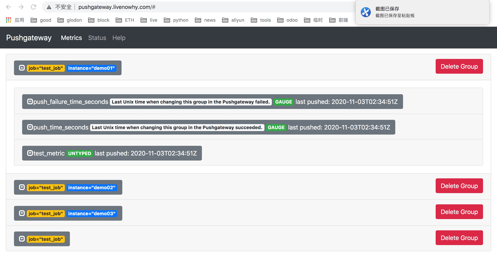
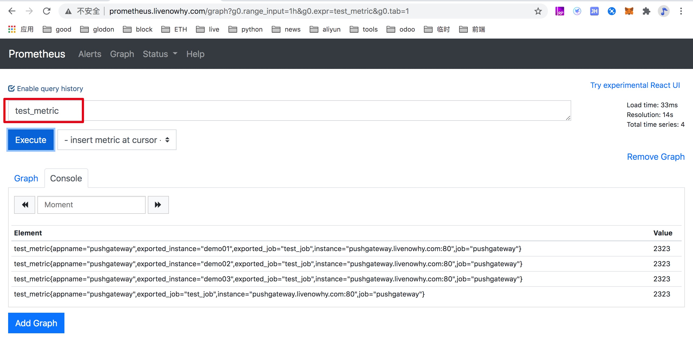

# PushGateway
## 使用场景介绍及部署

    Prometheus 是一套开源的系统监控、报警、时间序列数据库的组合。
    Prometheus 基本原理是通过 Http 协议周期性抓取被监控组件的状态，而输出这些被监控的组件的 Http 接口为 Exporter。
    PushGateway 作为 Prometheus 生态中的一个重要一员，它允许任何客户端向其 Push 符合规范的自定义监控指标，在结合 Prometheus 统一收集监控。
    
    PushGateway 使用场景:
    Prometheus 采用定时 Pull 模式，可能由于子网络或者防火墙的原因，不能直接拉取各个 Target 的指标数据，此时可以采用各个 Target 往 PushGateway 上 Push 数据，然后 Prometheus 去 PushGateway 上定时 pull。
    其次在监控各个业务数据时，需要将各个不同的业务数据进行统一汇总，此时也可以采用 PushGateway 来统一收集，然后 Prometheus 来统一拉取。

## 部署
    
    1、二进制包安装
    
    2、docker 安装
    $ docker run --name=${CONTAINER_NAME} -d -p 9091:9091 registry.cn-zhangjiakou.aliyuncs.com/livenowhy/pushgateway:lastest "-persistence.file=pg_file –persistence.interval=5m"
    
    prometheus.yml 添加 target
    - job_name: 'push-metrics'
        static_configs:
        - targets: ['localhost:9091']
        honor_labels: true
    
    因为 prometheus 配置 pushgateway 的时候,也会指定 job 和 instance, 但是它只表示pushgateway实例, 不能真正表达收集数据的含义。
    所以配置 pushgateway 需要添加 honor_labels:true, 避免收集数据本身的 job 和 instance 被覆盖。
    注意: 为了防止 pushgateway 重启或意外挂掉，导致数据丢失，可以通过 -persistence.file 和 -persistence.interval 参数将数据持久化下来。
    访问 http://corevm.livenowhy.com:9091/metrics 可以看到 pushgateway 自身的指标

## API 方式 Push 数据到 PushGateway

    要 Push 数据到 PushGateway 中，可以通过其提供的 API 标准接口来添加。
    默认 URL 地址为: http://<ip>:9091/metrics/job/<JOBNAME>{/<LABEL_NAME>/<LABEL_VALUE>}
    其中 <JOBNAME> 是必填项，为 job 标签值，后边可以跟任意数量的标签对，一般我们会添加一个 instance/<INSTANCE_NAME> 实例名称标签，来方便区分各个指标。
    
    接下来，可以 Push 一个简单的指标数据到 PushGateway 中测试一下。
    $ echo "test_metric 2323" | curl --data-binary @- http://corevm.livenowhy.com:9091/metrics/job/test_job
    $ echo "test_metric 2323" | curl --data-binary @- http://corevm.livenowhy.com:9091/metrics/job/test_job/instance/demo01
    
    执行完毕，刷新一下 PushGateway UI 页面，此时就能看到刚添加的 test_metric 指标数据了。
    需要注意: 使用这种方法，如果使用相同的job名 ，后面插入的数据会覆盖掉之前的
    
  
    
    除了 test_metric 外，同时还新增了 push_time_seconds 和 push_failure_time_seconds 两个指标，这两个是 PushGateway 系统自动生成的相关指标。
    此时，我们在 Prometheus UI 页面上 Graph 页面可以查询的到该指标了。

  
  
    这里要着重提一下的是:
    上图中 test_metric 我们查询出来的结果为:
    test_metric{appname="pushgateway",exported_instance="demo01",exported_job="test_job",instance="corevm.livenowhy.com:9091",job="pushgateway"}。

    这次，我们 Push 一个复杂一些的，一次写入多个指标，而且每个指标添加 TYPE 及 HELP 说明。

    $ cat <<EOF | curl --data-binary @- http://corevm.livenowhy.com:9091/metrics/job/test_job/instance/test_instance
    # TYPE test_metrics counter
    test_metrics{label="app1",name="demo"} 100.00
    # TYPE another_test_metrics gauge
    # HELP another_test_metrics Just an example.
    another_test_metrics 123.45
    EOF

## 使用 PushGateway 注意事项
    1、指标值只能是数字类型，非数字类型报错
    
    $ echo "test_metric 12ff" | curl --data-binary @- http://corevm.livenowhy.com:9091/metrics/job/test_job_1
    text format parsing error in line 1: expected float as value, got "12ff"
    
    2、指标值支持最大长度为 16 位，超过16 位后默认置为 0
    
    $ echo "test_metric 1234567898765432123456789" | curl --data-binary @- corevm.livenowhy.com:9091/metrics/job/test_job_2
    # 实际获取值 test_metric{job="test_job_2"}	1234567898765432200000000

    3、PushGateway 数据持久化操作
    
    默认 PushGateway 不做数据持久化操作，当 PushGateway 重启或者异常挂掉，导致数据的丢失。
    我们可以通过启动时添加 -persistence.file 和 -persistence.interval 参数来持久化数据。
    -persistence.file 表示本地持久化的文件，将 Push 的指标数据持久化保存到指定文件；
    -persistence.interval 表示本地持久化的指标数据保留时间，若设置为 5m，则表示 5 分钟后将删除存储的指标数据。
    
    $ docker run -d -p 9091:9091 prom/pushgateway "-persistence.file=pg_file –-persistence.interval=5m"
    
    4、PushGateway 推送及 Prometheus 拉取时间设置
    
    Prometheus 每次从 PushGateway 拉取的数据，并不是拉取周期内用户推送上来的所有数据，
    而是最后一次 Push 到 PushGateway 上的数据，所以推荐设置推送时间小于或等于 Prometheus 拉取的时间，
    这样保证每次拉取的数据是最新 Push 上来的。

## Metrics
    
    Prometheus 提供 4 种类型 Metrics: Counter, Gauge, Summary 和 Histogram
    1、Counter (计数器类型)
    Counter 可以增长，并且在程序重启的时候会被重设为0，常被用于任务个数，总处理时间，错误个数等只增不减的指标。
    
    2、Gauge (仪表盘类型)
    Gauge 是可增可减的指标类，可以用于反应当前应用的状态。
    比如在监控主机时，主机当前的内容大小(node_memory_MemFree)，可用内存大小(node_memory_MemAvailable)。
    或者时容器当前的 cpu 使用率，内存使用率。Gauge 指标对象主要包含两个方法inc() 以及dec()，用户添加或者减少计数。
    
    3、Summary 
    
    Summary 类型和 Histogram 类型相似，由<basename>{quantile="< φ>"}，< basename>_sum，< basename>_count组成，
    主要用于表示一段时间内数据采样结果(通常时请求持续时间或响应大小)，它直接存储了quantile数据，而不是根据统计区间计算出来的。
    Summary与Histogram相比，存在如下区别:
    都包含 < basename>_sum和< basename>_count;
    Histogram 需要通过< basename>_bucket计算quantile，而Summary直接存储了quantile的值。
    在 Prometheus 自定义的 metrics 监控中，Summary 的使用可以参考如下:
    
    Summary 类型指标中包含的数据如下:

    a、事件发生总的次数
    # 含义：当前http请求发生总次数为12次
    io_namespace_http_requests_latency_seconds_summary_count{path="/",method="GET",code="200",} 12.0
    
    
    b、事件产生的值的总和
    # 含义：这12次http请求的总响应时间为 51.029495508s
    io_namespace_http_requests_latency_seconds_summary_sum{path="/",method="GET",code="200",} 51.029495508
    
    c、事件产生的值的分布情况
    # 含义：这12次http请求响应时间的中位数是3.052404983s
    io_namespace_http_requests_latency_seconds_summary{path="/",method="GET",code="200",quantile="0.5",} 3.052404983
    # 含义：这12次http请求响应时间的9分位数是8.003261666s
    io_namespace_http_requests_latency_seconds_summary{path="/",method="GET",code="200",quantile="0.9",} 8.003261666
    

    4、Histogram (直方图类型)
    
    Histogram 由 < basename>_bucket{le="< upper inclusive bound>"}，< basename>_bucket{le="+Inf"}, < basename>_sum，_count 组成。
    主要用于表示一段时间范围内对数据进行采样(通常是请求持续时间或响应大小)，并能够对其指定区间以及总数进行统计，通常它采集的数据展示为直方图。
    在Prometheus 自定义的 metrics 监控中，Histgram 的使用可以参考如下:
    以请求响应时间 requests_latency_seconds 为例，比如我们需要记录 http 请求响应时间符合在分布范围{0.005，0.01，0.025，0.05，0.075，0.1，0.25，0.5，0.75，1，2.5，5，7.5，10}中的次数时
    使用 Histogram 构造器在创建 Histogram 监控指标时，默认的buckets范围为{0.005，0.01，0.025，0.05，0.075，0.1，0.25，0.5，0.75，1，2.5，5，7.5，10}，如果要修改默认的buckets，可以使用.buckets(double… bukets)覆盖。
    
    Histogram会自动创建3个指标，分别为:
    a、事件发生的总次数，basename_count。
    # 实际含义： 当前一共发生了2次http请求
    io_namespace_http_requests_latency_seconds_histogram_count{path="/",method="GET",code="200",} 2.0
    
    b、所有事件产生值的大小的总和，basename_sum。
    # 实际含义： 发生的2次http请求总的响应时间为13.107670803000001 秒
    io_namespace_http_requests_latency_seconds_histogram_sum{path="/",method="GET",code="200",} 13.107670803000001
    
    c、事件产生的值分布在bucket中的次数，basename_bucket{le=“上包含”}

## 参考文档

    https://blog.csdn.net/aixiaoyang168/article/details/102818289
    https://github.com/prometheus/client_python
    https://www.cnblogs.com/xiaobaozi-95/p/10684524.html