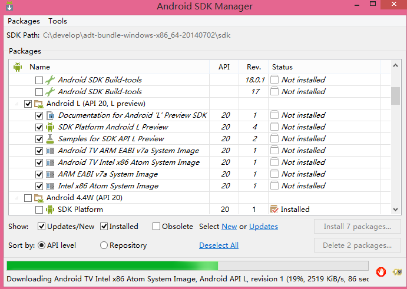

# Android SDK Manager 国内下载缓慢的问题
  
  1. 在Android SDK Manager Setting 窗口设置HTTP Proxy server和HTTP Proxy Port这个2个参数，分别设置为:
    
    ``HTTP Proxy server：mirrors.neusoft.edu.cn
    HTTP Proxy Por：80

  2. options>Force ..http://...sources to be fetched using http://..选中该选项
  
  3. Packages>reload 即可
  