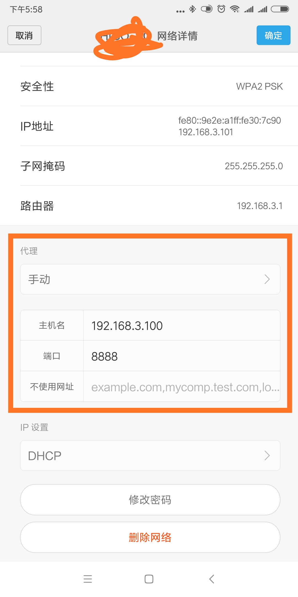

# Fiddler 抓包

## fiddler抓手机app的请求

  环境准备:

  `1` 电脑上已装fiddler

  `2` 手机和电脑在同一局域网

## fiddler设置

  `1` fiddler > Tools > Fiddler Options > Connections 勾选Allow remote computers to connect

  `2` 记住这里的端口号: 8888, 后面会用到

  

## 查看电脑IP

  打开cmd, 输入: ipconfig, 记住这个IPv4地址

  

## 手机设置代理

  `1` 手机设置 -> WLAN设置 -> 选择该wifi, 点右边的箭头(有的手机是长按弹出选项框,如下我的小米手机配置)

  `2` 选择修改网络配置(红色框框配置)

  配置主机名: 与主机电脑IP地址保持一致

  端  口 号: 8888

  

  `3` 保存后就可以抓到来自手机的请求了

## 抓APP上的HTTPS请求

  `1` 如果app都是http请求，是不需要安装证书，能直接抓到的，如果是https请求，这时候手机就需要下载证书了。

  `2` 打开手机浏览器输入：http://192.168.3.100:8888, 这个中间的host地址就是前面查到的本机地址。

  `3` 出现如下画面，点箭头所指的位置，点击安装就可以了 (需要开启https才能正常下载证书)

  

## 设置过滤

`1` 手机上设置代理后,这时候fiddler上抓到的是pc和app所有的请求,如果pc上打开网址,会很多,这时候就需要开启过滤功能了.

`2` 打开fiddler > Tools > Fiddler Options > HTTPS >...from remote clients only, 勾选这个选项就可以了

    ...from all processes :抓所有的请求

    ...from browsers only ：只抓浏览器的请求

    ...from non-browsers only :只抓非浏览器的请求

    ...from remote clients only:只抓远程客户端请求

  

